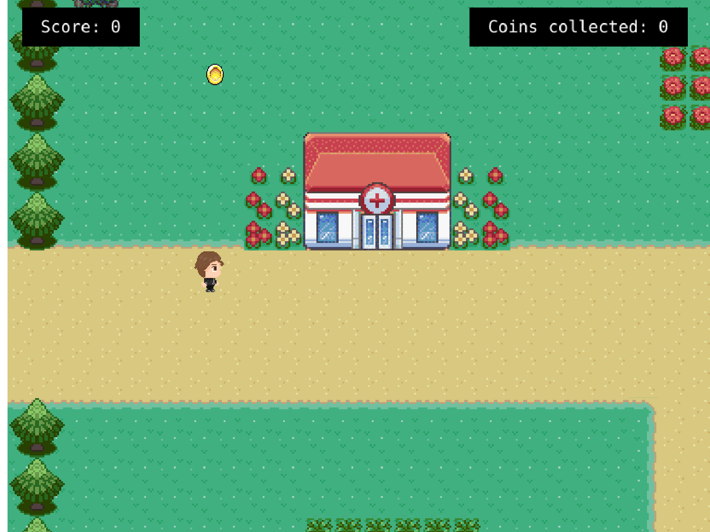
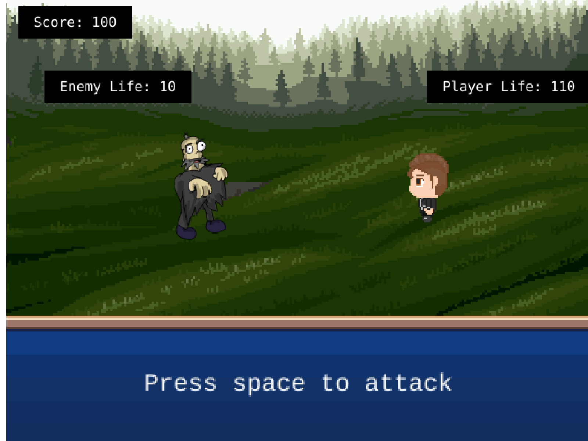

# Collector Craft
> An open-world turn-based RPG built with Phaser 3.

## Prologue

The story begins at a very difficult time. An unknown virus has taken over Mapple Town.
Peoples who are affected by the virus have turned into zombies. They wander around the streets 
and attack others. 

Throughout the town, 10 gold coins are scattered. These 10 gold coins are the last hope of this town. The combination of these 10 coins can give us the secret formula for the 
vaccine.

Your goal is to collect all the 10 coins. In your adventure, you will face the zombies randomly.
You will have to fight them in a turn-based fight. 

## Screenshot

## Features 

1. Player can move around an open world.
1. Player can collect coins.
1. Player score will increase by 100 if one coin is collected.
1. Player can fight with the zombies.
1. Player and Zombies have life points.

## How to play the game?

- Move up with `up arrow`
- Move down with `down arrow`
- Move right with `right arrow`
- Move left with `left arrow`
- Attack zombies with `space`

## Built With

- Phaser 3
- HTML/CSS
- Javascript
- Webpack

## Live Demo

- [Collector Craft](https://eloquent-wing-438537.netlify.app/)

## How to run this project on your local machine

### Prerequisites
1. An internet browser
1. npm
1. Phaser

   
### Steps to follow
1. Clone the repository to your local machine using `git clone https://github.com/ershadul1/weather-now.git`
1. On your local machine, navigate to the folder using `cd weather-now` in your terminal.
1. Run `npm install` for installing all the dependencies.
1. Run `npm run start` to run the game on your local webserver.
1. Visit `http://localhost:8080/` to play the game from your browser.

### Testing the game

1. Run `npm test` to run the tests

## Contributions

  There are two ways of contributing to this project:

1.  If you see something wrong or not working, please check [the issue tracker section](https://github.com/ershadul1/collector-craft/issues), if that problem you met is not in already opened issues then open the issue by clicking on the `new issue` button.

2.  If you have a solution to that, and you are willing to work on it, follow the below steps to contribute:
    1.  Fork this repository
    1.  Clone it on your local computer by running `git clone https://github.com/ershadul1/collector-craft.git` __Replace *ershadul1* with the username you use on github__
    1.  Open the cloned repository which appears as a folder on your local computer with your favorite code editor
    1.  Create a separate branch of the *master branch*,
    1.  Write your codes that fix the issue you found
    1.  Commit and push the branch you created
    1.  Raise a pull request, comparing your new created branch with our original master branch [here](https://github.com/ershadul1/collector-craft)

## Author 

👤 **Ershadul Rayhan**

- Github: [@ershadul1](https://github.com/ershadul1)
- Twitter: [@ErshadulRayhan](https://twitter.com/ErshadulRayhan)
- Linkedin: [ErshadulRayhan](https://www.linkedin.com/in/ershadulrayhan/)
- Email:  ershadul.rayhan@gmail.com

## Show your support

Give a ⭐️ if you like this project!

## Acknowledgments
- This project was inspired by the [Microverse](https:www.microverse.org) program
- Game Assets were taken from [Open Game Art](https://opengameart.org/)
- Map tileset was taken from this [Github Repo](https://github.com/mikewesthad/phaser-3-tilemap-blog-posts/tree/master/examples/post-1)